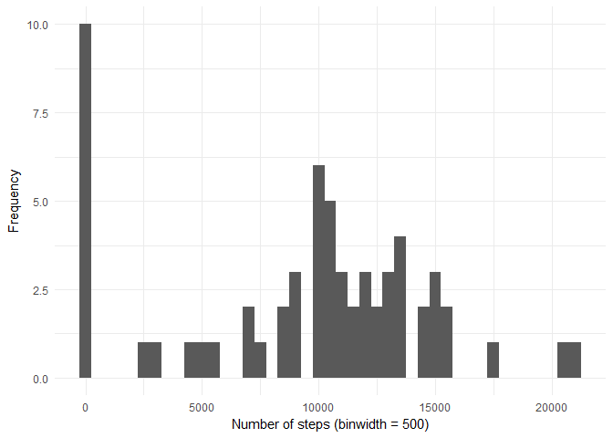
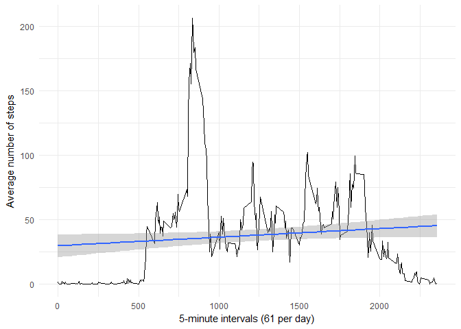

***
## Loading and preprocessing the data

1. Load the data

```r
if(!file.exists("activity.csv")){ unzip("activity.zip") }
activity <- read.csv("activity.csv", header = TRUE, stringsAsFactors = FALSE)
```

2. Process/transform the data

```r
library(dplyr)
```

Group the sum of steps by date

```r
steps.by.date.sum <- activity %>%
  group_by(date) %>%
  summarise(
    n=n(),
    steps = sum(steps, na.rm = TRUE)
  ) 
```

Change the date column class, from character to date

```r
steps.by.date.sum$date <- as.Date(steps.by.date.sum$date, "%Y-%m-%d")
```
***
## What is mean total number of steps taken per day?

1. Make a histogram of the total number of steps taken each day

Load library

```r
library(ggplot2)
```

Histogram

```r
ggplot(data = na.omit(steps.by.date.sum), aes(x=steps)) +
  geom_histogram(binwidth = 500) +
  theme_minimal() + 
  xlab("Number of steps (binwidth = 500)") + 
  ylab("Frequency")
```

<!-- -->

2. Calculate and report the mean and median total number of steps taken per day

```r
round(mean(steps.by.date.sum$steps, na.rm = TRUE), digits = 0)
```

```
## [1] 9354
```

```r
round(median(steps.by.date.sum$steps, na.rm = TRUE), digits = 0)
```

```
## [1] 10395
```
***
## What is the average daily activity pattern?

1. Make a time series plot of the 5-minute interval (x-axis) and the average number of steps taken, averaged across all days (y-axis)

Group average number of steps by interval

```r
steps.by.interval.mean <- activity %>%
  group_by(interval) %>%
  summarise(
    n=n(),
    mean.steps = mean(steps, na.rm = TRUE)
  ) 
```

Plot

```r
ggplot(data = na.omit(steps.by.interval.mean), aes(x=interval,y=mean.steps)) +
  geom_line() +
  geom_smooth(method = "lm") + 
  theme_minimal() + 
  xlab("5-minute intervals (61 per day)") + 
  ylab("Average number of steps")
```

<!-- -->

2. Which 5-minute interval, on average across all the days in the dataset, contains the maximum number of steps?


```r
index.max <- which.max(steps.by.interval.mean$mean.steps)
steps.by.interval.mean$interval[index.max]
```

```
## [1] 835
```
***
## Imputing missing values

1. Calculate and report the total number of missing values in the dataset (i.e. the total number of rows with NAs)


```r
# CHECK ACTIVITY FOR MISSING VALUES
summary(activity)
```

```
##      steps            date              interval     
##  Min.   :  0.00   Length:17568       Min.   :   0.0  
##  1st Qu.:  0.00   Class :character   1st Qu.: 588.8  
##  Median :  0.00   Mode  :character   Median :1177.5  
##  Mean   : 37.38                      Mean   :1177.5  
##  3rd Qu.: 12.00                      3rd Qu.:1766.2  
##  Max.   :806.00                      Max.   :2355.0  
##  NA's   :2304
```


```r
# ONLY COLUMN STEPS HAS MISSING VALUES
sum(is.na(activity$steps))
```

```
## [1] 2304
```

2. Devise a strategy for filling in all of the missing values in the dataset. The strategy does not need to be sophisticated. For example, you could use the mean/median for that day, or the mean for that 5-minute interval, etc.

**The strategy is to impute the missing steps values, with the corresponding 5-minute interval mean.**

3. Create a new dataset that is equal to the original dataset but with the missing data filled in.


```r
# COPY EXISTING ACTIVITY DATAFRAME
activity.impute <- activity
```

```r
# GET INDICIES OF NA STEPS
index.na.steps <- which(is.na(activity.impute$steps))
```

```r
# GET INTERVALS FOR NA STEPS VALUES
index.na.interval <- activity.impute$interval[index.na.steps]
```

```r
# GET INDICIES FOR ALL NA REPLACEMENTS FROM INTERVAL MEAN STEPS
index.na.interval.mean <- match(index.na.interval, steps.by.interval.mean$interval)
```

```r
# IMPUTE MISSING STEPS VALUES WITH MEAN STEPS FOR CORRESPONDING INTERVAL
activity.impute$steps[index.na.steps] <- round(steps.by.interval.mean$mean.steps[index.na.interval.mean], digits = 0)
```
  
4. Make a histogram of the total number of steps taken each day and Calculate and report the mean and median total number of steps taken per day. Do these values differ from the estimates from the first part of the assignment? What is the impact of imputing missing data on the estimates of the total daily number of steps?

**Answer: The average (mean) steps taken each day increased from 9,354 to 10,766 (increase 15%), while the median steps taken each day increased from 10,395 to 10,762 (increase 4%).**

Group data based on new source

```r
# GROUP SUM OF STEPS BY DATE
steps.by.date.sum.imputed <- activity.impute %>%
  group_by(date) %>%
  summarise(
    n=n(),
    steps = sum(steps, na.rm = TRUE)
  ) 
```

Change the date column class, from character to date

```r
# CHANGE CLASS OF DATE COLUMN FROM CHARACTER TO DATE
steps.by.date.sum.imputed$date <- as.Date(steps.by.date.sum.imputed$date, "%Y-%m-%d")
```

Histogram

```r
ggplot(data = na.omit(steps.by.date.sum.imputed), aes(x=steps)) +
  geom_histogram(binwidth = 500) +
  theme_minimal() + 
  xlab("Number of steps, imputed NA (binwidth = 500)") + 
  ylab("Frequency")
```

<!-- -->

Mean and median values (Imputed data)

```r
round(mean(steps.by.date.sum.imputed$steps, na.rm = TRUE), digits = 0)
```

```
## [1] 10766
```

```r
round(median(steps.by.date.sum.imputed$steps, na.rm = TRUE), digits = 0)
```

```
## [1] 10762
```
***
## Are there differences in activity patterns between weekdays and weekends?

**Answer: The maximum number of steps during weekends are lower than weekdays. Also the step activity starts later in the day on weekends.**

1. Create a new factor variable in the dataset with two levels -- "weekday" and "weekend" indicating whether a given date is a weekday or weekend day.

Change the date column class, from character to date

```r
# CHANGE CLASS OF DATE COLUMN FROM CHARACTER TO DATE
activity.impute$date <- as.Date(activity.impute$date, "%Y-%m-%d")
```

New variable

```r
# NEW VARIABLE 'DAY' TO DETERMINE IF ITS A WEEKDAY OR WEEKEND
activity.impute <- activity.impute %>%
  mutate(day = ifelse(weekdays(activity.impute$date) %in% c("Saturday","Sunday"), "weekend", "weekday"))
```

2. Make a panel plot containing a time series plot (i.e. type = "l") of the 5-minute interval (x-axis) and the average number of steps taken, averaged across all weekday days or weekend days (y-axis).

Group data

```r
# GROUP MEAN STEPS BY DAY AND INTERVAL
steps.by.interval.day <- activity.impute %>%
  group_by(day, interval) %>%
  summarise(
    n=n(),
    mean.steps = mean(steps, na.rm = TRUE)
  ) 
```

Plot

```r
# PLOT MEAN STEPS BY DAY AND INTERVAL
ggplot(data = na.omit(steps.by.interval.day), aes(x=interval,y=mean.steps)) +
  geom_line() +
  facet_grid(day ~ .) +
  theme_minimal() + 
  xlab("5-minute intervals (61 per day)") + 
  ylab("Average number of steps")
```

<!-- -->
***
